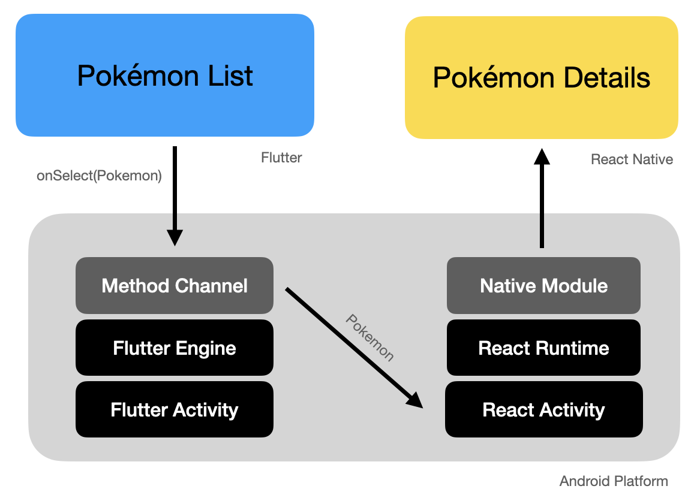
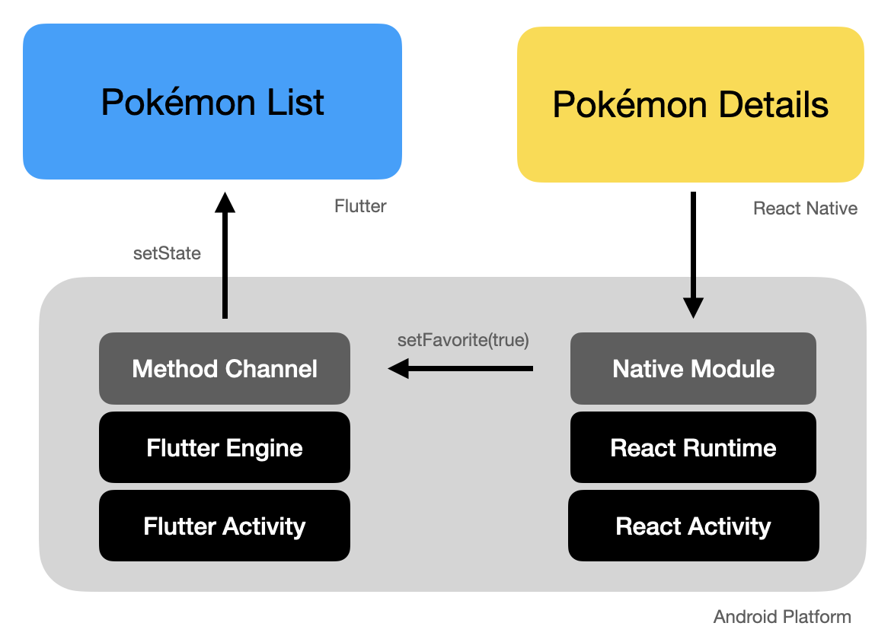

# Flutter Demo

A demo to show how to integrate a React Native screen inside a Flutter app.

## How is this posible?

This is posible by [integrating react native with an existing app](https://reactnative.dev/docs/0.74/integration-with-existing-apps?language=kotlin)

[Here](https://github.com/gbiktx/rn-demo-app) is the react native app used in this demo.

## Checklist
[ ] iOS support
[ ] Autolinking

## Versions
- Java 17
- Node v22
